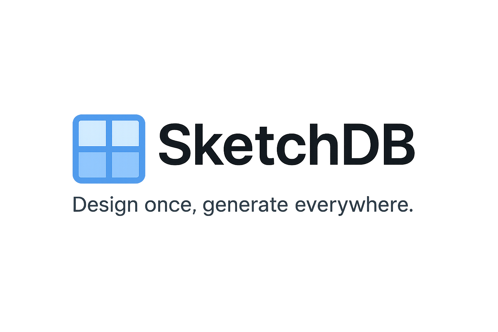

# SketchDB  
**Design once, generate everywhere.**  
*Visualize your database schema and export framework-ready models in a single click.*  

 <!-- Replace with your logo path -->

---

## ✨ Overview
**SketchDB** is an open-source tool that empowers developers, architects, and teams to **design database schemas visually** and instantly **export production-ready model files**.  

Unlike traditional ERD/diagramming tools, SketchDB goes beyond visualization — it bridges the gap between **schema design** and **framework-ready code generation**.  

---

## 🚀 Features
- 🎨 **Visual Database Design** – create tables, fields, and relationships easily.  
- ⚡ **One-Click Export** – generate ORM models directly.  
- 🛠️ **Framework-Specific Support (out of the box)**  
  - Django (Python ORM models)  
  - FastAPI / SQLAlchemy  
  - Odoo ORM  
  - …more coming soon (NestJS, Laravel, Rails).  
- 🔒 **Accuracy & Consistency** – no manual errors when converting diagrams to code.  
- 🌍 **Open & Extensible** – add custom exporters for any framework.  

---

## 💡 Why SketchDB? (USP)
Most tools stop at diagramming. **SketchDB is different.**  
It not only helps you **design schemas visually**, but also:  

1. **Generates framework-ready code** (models, migrations, relationships).  
2. **Saves development time** by removing boilerplate.  
3. **Keeps your schema and models in sync.**  
4. **Accelerates onboarding** for teams working across multiple frameworks.  

👉 *Design once, generate everywhere.*  

---

## 🎯 Who is it for?
- Backend Developers  
- Full-stack Teams  
- Database Architects  
- SaaS Builders  
- Open-source Contributors  

---

## 📦 Installation
Clone the repo and install dependencies:

```bash
git clone https://github.com/your-username/sketchdb.git
cd sketchdb
# Example if using Python
pip install -r requirements.txt
